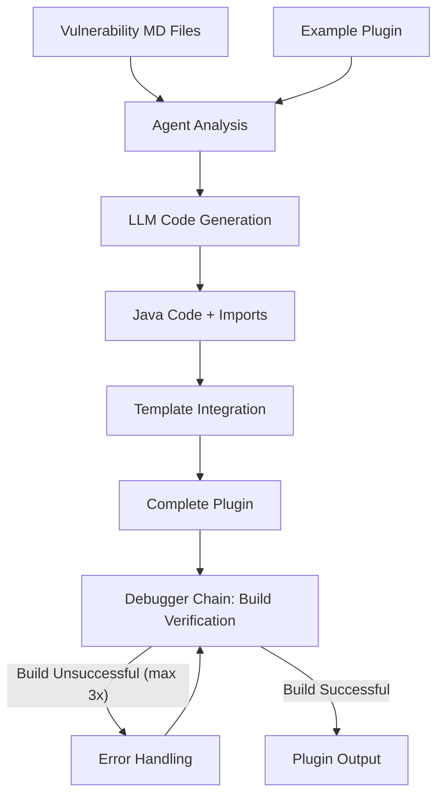

# Tsunami Agent 🌊

An intelligent agent that automatically generates **Tsunami Security Scanner plugins** for OWASP Juice Shop vulnerabilities using Large Language Models (LLMs).

## Overview
- **Reads vulnerability descriptions** from markdown files
- **Analyzes OWASP Top 10 vulnerabilities** and attack vectors
- **Generates complete Java detection plugins** for Tsunami Security Scanner
- **Learns from example implementations** to ensure correct API usage
- **Automatically injects imports** and handles complex vulnerability detection logic

### Plugin Generation Pipeline
1. **Vulnerability Analysis**: Reads and parses vulnerability descriptions
2. **Example Learning**: Studies existing plugin implementations
3. **Code Generation**: Creates comprehensive detection logic
4. **Template Integration**: Injects code into Tsunami plugin templates
5. **Build Verification**: Ensures generated plugins compile successfully (The Agent Debugger Chain is executed in ~50% of plugin generations and fixes the issue generally after 1 iteration)
6. **Output**: Provides a complete Tsunami plugin ready for deployment (But maybe test first)

## 📋 Prerequisites

- **Python 3.10+**
- **Poetry** (for dependency management)
- **API Keys**: OpenAI or Anthropic API access

## 🔧 Installation

### 1. Clone the Repository
```bash
git clone https://github.com/jlb-jlb/Tsunami-Agent.git
cd tsunami-agent
```

### 2. Install Dependencies
```bash
poetry install
# or on the server
python3 -m pip install . --break-system-packages
```

### 3. Configure Environment
```bash
cp .env.example .env
# Edit .env with your API keys:
# ANTHROPIC_API_KEY=your_anthropic_key_here
# OPENAI_API_KEY=your_openai_key_here
```

### 4. Verify Installation
```bash
poetry run python cli.py --list-vulnerabilities
```

## Quick Start

### Generate a Plugin

```bash
# List all available vulnerability types
poetry run python cli.py -l

# Generate SQL injection detection plugin 
poetry run python cli.py -v sql_injection

# Generate XSS detection plugin with specific model
poetry run python cli.py -v xss -m gpt-4 -p openai

# List all available vulnerability types
poetry run python cli.py -l
```

### Use the Python API
```python
from tsunami_agent import create_plugin_workflow

class Args:
    model_provider = "anthropic"
    model = "claude-sonnet-4-20250514"

# Generate plugin
plugin = create_plugin_workflow(Args(), "sql_injection")
print(f"Generated: {plugin.plugin_name}")
```

## Project Structure

```
tsunami-agent/
├── src/tsunami_agent/           # Core agent implementation
│   ├── main.py                  # Main workflow and LLM orchestration
│   ├── tools.py                 # LangChain tools and utilities
│   └── templater.py             # Plugin template generation
├── vulnerabilities/             # Vulnerability descriptions (14 types)
├── example_plugins/             # Reference implementations
├── tsunami-agent-plugins/       # Generated plugin output
├── cli.py                       # Command-line interface
└── tests/                       # Test suite
```

## Workflow Architecture



### Key Components

#### 1. **LLM Agent** (`main.py`)
- Orchestrates the entire plugin generation workflow
- Uses LangChain for tool calling and structured output

#### 2. **Tools System** (`tools.py`)
- **Vulnerability Reader**: Parses markdown vulnerability descriptions
- **Example Detector Reader**: Studies reference implementations
- **Template Creator**: Generates plugin with injected code

#### 3. **Template Engine** (`templater.py`)
- Creates complete Gradle-based plugin projects
- Supports dynamic Java code and import injection
- Generates proper plugin metadata and configuration
- Ensures compilation compatibility

## Configuration

### Model Selection
```bash
# Use Anthropic Claude (default)
poetry run python cli.py -v sql_injection -p anthropic -m claude-sonnet-4-20250514

# Use OpenAI GPT-4
poetry run python cli.py -v xss -p openai -m gpt-4
```


## Example Output

### Generated Plugin Structure
```
SqlInjectionDetector_vulnerability/
├── build.gradle                          # Gradle build configuration
├── settings.gradle                       # Gradle settings  
├── gradlew                              # Gradle wrapper script
├── gradle/                              # Gradle wrapper files
│   └── wrapper/
└── src/main/java/com/google/tsunami/plugins/raid/
    ├── SqlInjectionDetector.java           # Main detection logic
    └── SqlInjectionDetectorBootstrapModule.java  # Plugin bootstrap
